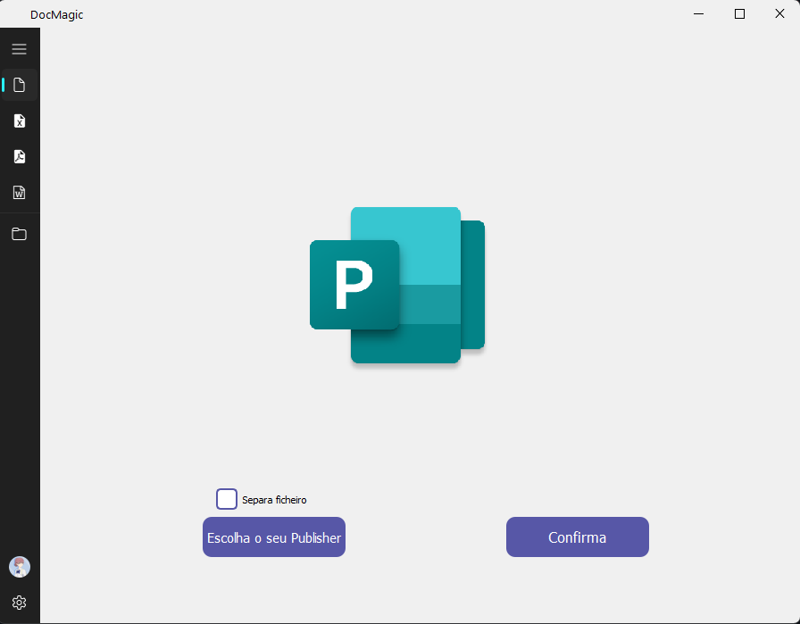

# DocMagic - Office and Publisher File to PDF Converter

<div align="center">
  
</div>

## Project Description

DocMagic is an application that allows you to easily convert various types of Office and Publisher files to PDF format. With a user-friendly interface and powerful features, DocMagic simplifies the conversion process while preserving the original formatting of your documents. The application supports popular Office file formats such as Word documents, PowerPoint presentations, Excel spreadsheets, as well as Publisher files.

<div align="center">
  
</div>

## Key Features


- Office and Publisher File to PDF Conversion: You can select one or multiple Office or Publisher files to convert them to PDF format. The application supports commonly used file formats, including .doc, .docx, .ppt, .pptx, .xls, .xlsx, and .pub. Once the conversion is complete, the PDF files are saved in the specified folder.
- Advanced Conversion Options: DocMagic offers advanced conversion options to cater to your specific needs. You can choose to convert specific pages, include annotations or comments, define PDF quality settings, and more.
- Fluid User Interface: The application is built with the QFluentWidgets library, providing a fluid and appealing user interface. You can easily navigate between different application features and enjoy a seamless conversion experience.


## Used Libraries


  The DocMagic project utilizes the following libraries:
  
- PyQt5: A Python library for creating graphical user interfaces.

- PyPDF2: A Python library for manipulating PDF files.

- win32com: A Python library for interacting with Office applications using the Component Object Model (COM).

- QFluentWidgets: A Python library for creating fluid user interfaces.


## Project Setup


  Make sure you have Python 3.x installed on your system.
  Clone or download this repository to your machine.
  Install the required dependencies by running the following command:

```bash
pip install PyQt5 PyPDF2 pywin32 qfluentwidgets pyinstaller
```

## Usage

Run the application by executing the main.py file:
```bash
python MainInterface.py
```

The DocMagic application will open with an appealing user interface. Click the "Select Files" button to choose the Office or Publisher files you want to convert to PDF.

After selecting the files, you can customize the conversion options according to your needs. For example, you can specify specific pages to convert, include annotations, etc.

Once the conversion options are configured, click the "Convert" button to start the conversion process. The converted PDF files will be saved in the specified folder.

(Optional) To create an executable file, run the following command:

```bash
pyinstaller --onefile --windowed --noconsole --name=DocMagic --icon=LogoIco.ico MainInterface.py
``` 

This will create a standalone executable file in the dist directory. You can distribute this file to users who do not have Python installed.
  
  
